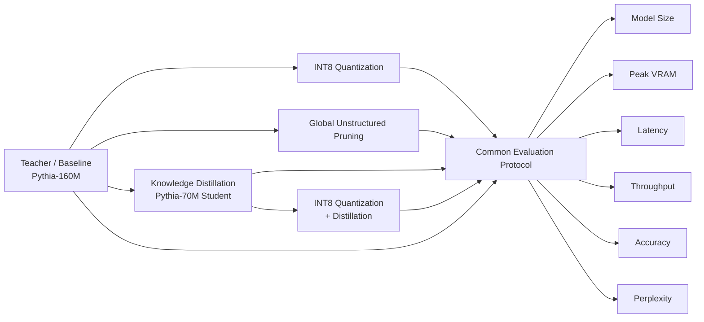
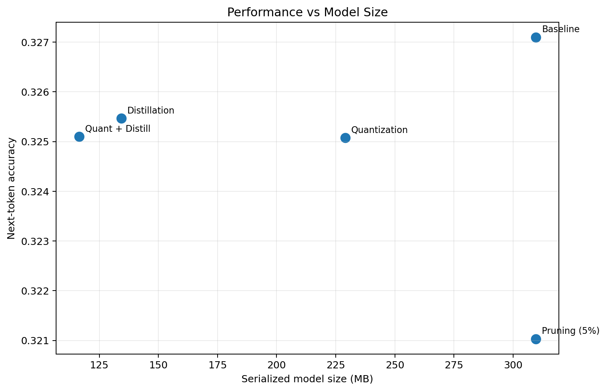
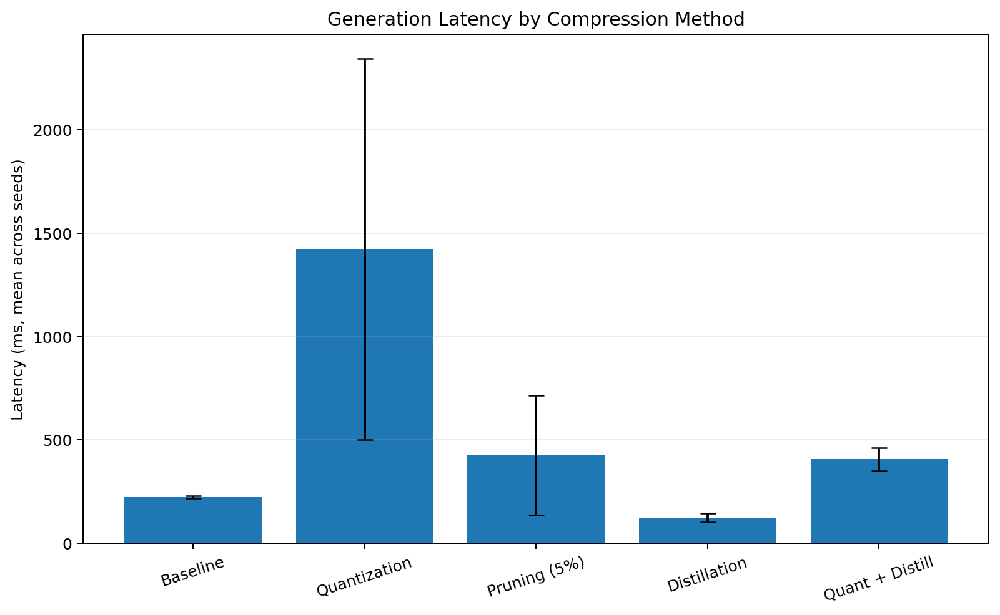
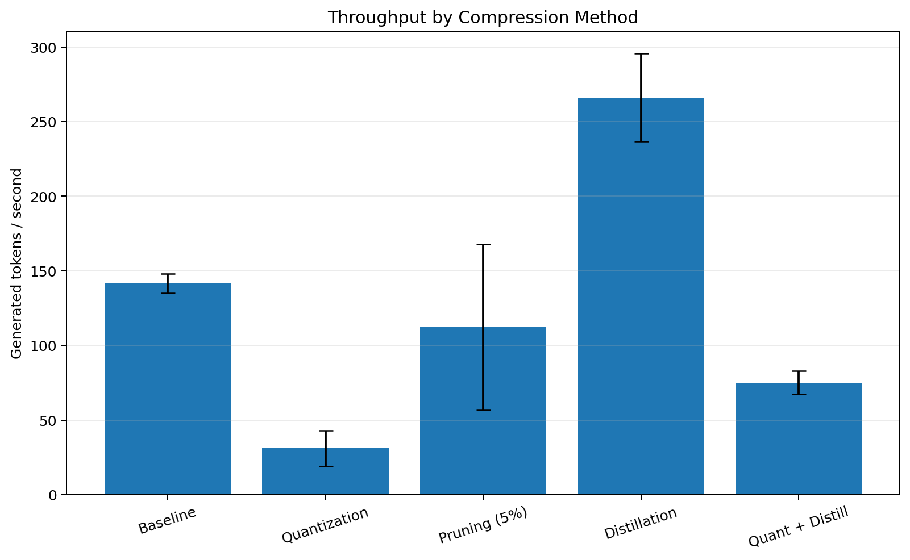
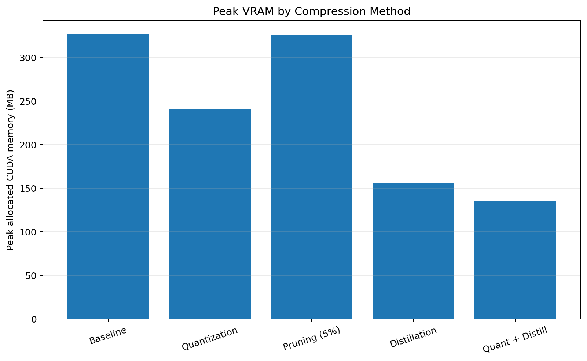
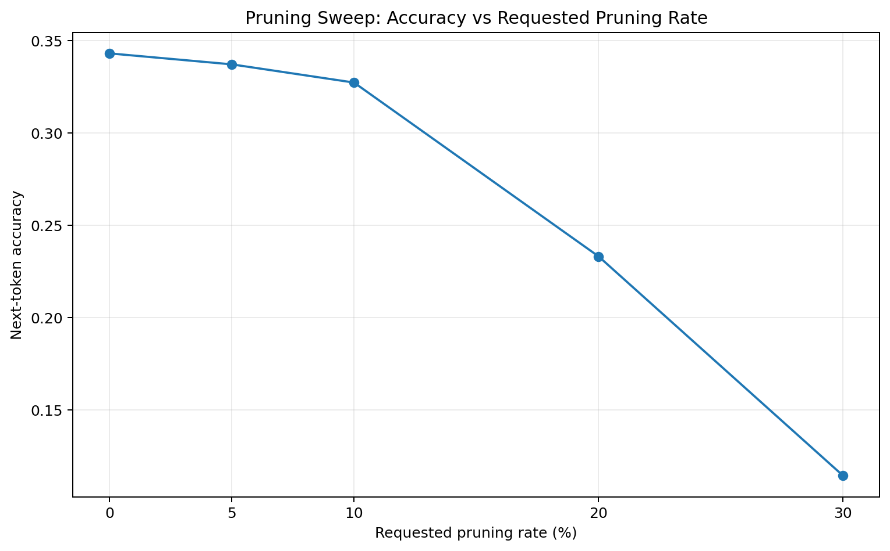

# LLM Compression Benchmark

> A reproducible framework for comparing practical LLM compression strategies under one evaluation protocol.

**Baseline → Quantization → Pruning → Distillation → Quantization + Distillation**

This project evaluates how different compression techniques trade off **model size, GPU memory, latency, throughput, accuracy, and perplexity** on the same model family, dataset, hardware, and decoding setup.

The goal is not to claim that one compression method is universally best. The goal is to make the trade-offs measurable and reproducible.

---

## Experiment at a Glance



### Core setup

| Component | Configuration |
|---|---|
| Baseline / teacher | `EleutherAI/pythia-160m` |
| Distilled student | `EleutherAI/pythia-70m` |
| Dataset | `Salesforce/wikitext` |
| Dataset config | `wikitext-2-raw-v1` |
| Final evaluation split | `test` |
| Quantization | INT8 with `bitsandbytes` on CUDA |
| Pruning | 5% global unstructured L1 magnitude pruning |
| Distillation | Offline logit knowledge distillation, CE + temperature-scaled KL |
| Seeds | `42`, `43`, `44` |
| Generation | Greedy decoding |
| Runtime protocol | 10 warm-up runs + 30 timed runs |

The 5% pruning level was selected after a separate validation-set sweep over **5%, 10%, 20%, and 30%**. Final quality numbers were then reported on the test split.

---

## Final Results

The table below reports the final three-seed experiment. Quality and runtime metrics are **mean ± standard deviation across seeds**. Model size is deterministic for a given checkpoint. Peak VRAM is shown from the validated CUDA benchmark run; it is included as a representative deployment-memory measurement rather than an across-seed statistic.

| Method | Model Size (MB) | Compression | Peak VRAM (MB) | Accuracy | Perplexity | Latency (ms) | Throughput (tok/s) |
|---|---:|---:|---:|---:|---:|---:|---:|
| **Baseline** | 309.62 | 1.00× | 326.40 | 0.327099 ± 0.000000 | 47.8782 ± 0.0000 | 223.63 ± 6.68 | 141.50 ± 6.40 |
| **Quantization** | 228.95 | 1.35× | 240.58 | 0.325077 ± 0.000000 | 48.4261 ± 0.0000 | 1421.63 ± 921.39 | 31.01 ± 11.97 |
| **Pruning (5%)** | 309.62 | 1.00× | 325.83 | 0.321032 ± 0.000000 | 49.8283 ± 0.0000 | 425.67 ± 288.95 | 112.28 ± 55.48 |
| **Distillation** | 134.34 | 2.30× | 156.13 | **0.325465 ± 0.000250** | 53.0355 ± 0.0337 | **124.01 ± 20.54** | **266.11 ± 29.53** |
| **Quantization + Distillation** | **116.45** | **2.66×** | **135.66** | 0.325102 ± 0.000063 | 53.2902 ± 0.0543 | 406.34 ± 55.92 | 75.06 ± 7.73 |

### Relative to baseline

| Method | Size Reduction | Peak VRAM Reduction | Relative Accuracy Drop | Perplexity Change | Latency Change | Throughput Change |
|---|---:|---:|---:|---:|---:|---:|
| Quantization | 26.1% | 26.3% | 0.62% | +1.14% | +535.7% | -78.1% |
| Pruning (5%) | 0.0% | 0.2% | 1.85% | +4.07% | +90.3% | -20.7% |
| **Distillation** | **56.6%** | **52.2%** | **0.50%** | +10.77% | **-44.5%** | **+88.1%** |
| Quantization + Distillation | **62.4%** | **58.4%** | 0.61% | +11.30% | +81.7% | -47.0% |

---

## Performance vs Model Size



On the final test results, the **size-vs-accuracy Pareto frontier** is formed by:

- **Baseline** — highest accuracy.
- **Distillation** — much smaller model with almost no accuracy loss.
- **Quantization + Distillation** — smallest model, with only a small additional quality drop.

Pure quantization is dominated by distillation on these two axes because distillation is both **smaller** and **slightly more accurate** in the final test run. Pruning is dominated by the baseline because it keeps the same dense model size while reducing accuracy.

---

## Latency



The latency result is one of the most important findings of the benchmark: **compression does not automatically imply faster inference**.

Distillation produced the best runtime result, reducing mean latency from **223.63 ms** to **124.01 ms**, a **44.5% reduction**. In contrast, INT8 quantization with `bitsandbytes` was substantially slower in the tested CUDA environment and showed high run-to-run variance.

That observation is intentionally reported rather than hidden: for small models, quantization-kernel and conversion overhead can outweigh the theoretical arithmetic savings on a particular GPU/software stack.

---

## Throughput



Distillation achieved the highest measured throughput at **266.11 generated tokens/s**, compared with **141.50 tokens/s** for the baseline — an improvement of approximately **88%**.

The quantized variants reduced memory footprint but did not improve throughput on this test environment.

---

## Peak VRAM



The memory results show a different optimization story from latency:

- Quantization reduced peak VRAM by about **26%**.
- Distillation reduced peak VRAM by about **52%**.
- Quantization + Distillation reached the lowest measured peak VRAM, about **135.66 MB**, a reduction of roughly **58%** from baseline.

This makes **Quantization + Distillation** the strongest option when memory footprint is the primary deployment constraint, even though it was not the fastest option on the tested hardware.

---

## Pruning Sweep

Before the final experiment, pruning strength was evaluated on the validation split.



| Requested Pruning | Accuracy | Perplexity | Whole-model Sparsity |
|---:|---:|---:|---:|
| 0% | 0.343102 | 41.4965 | ~0.00% |
| 5% | 0.337167 | 43.1525 | 3.81% |
| 10% | 0.327311 | 48.1738 | 7.61% |
| 20% | 0.233263 | 135.6397 | 15.22% |
| 30% | 0.114601 | 881.8204 | 22.84% |

The sweep shows a clear nonlinear quality collapse as pruning becomes aggressive. **5% pruning** was therefore selected for the final experiment.

The reported whole-model sparsity is lower than the requested pruning percentage because pruning is applied only to eligible dense 2D weight matrices, while the sparsity metric is computed over all model parameters.

More importantly, this experiment uses **unstructured pruning with dense storage**. Zero-valued weights still occupy memory and checkpoint space, so pruning increases sparsity without reducing the physical model size unless a sparse representation and sparse execution kernels are used.

---

## Main Findings

### 1. Distillation gave the best overall trade-off

Distillation reduced model size from **309.62 MB to 134.34 MB** while keeping next-token accuracy within approximately **0.5% relative** of baseline. It also produced the best latency and throughput results.

For this experiment, it is the strongest choice when balancing **quality, model size, memory, and speed**.

### 2. Quantization preserved quality, but not speed

INT8 quantization reduced model size by **26.1%** and peak VRAM by **26.3%**, while the relative accuracy drop was only **0.62%**.

However, on the tested CUDA environment, its latency increased substantially and showed large variance:

```text
1421.63 ± 921.39 ms
```

The correct conclusion is therefore hardware-specific: **INT8 reduced memory footprint with negligible quality loss, but did not improve inference speed on this setup.**

### 3. Naive unstructured pruning did not reduce deployed model size

5% pruning increased sparsity but left the serialized dense checkpoint at **309.62 MB**. It also reduced accuracy and did not produce a stable speed advantage.

This highlights the difference between **weight sparsity** and **real deployment compression**.

### 4. Quantization + Distillation maximized compression

The combined method produced the smallest model:

```text
309.62 MB → 116.45 MB
Compression ratio: 2.66×
```

It also delivered the lowest peak VRAM, while keeping accuracy close to both the quantized and distilled variants. Its main cost was slower inference than pure distillation.

---

## What the Framework Measures

Each compression method is evaluated with the same evaluation and generation protocol.

| Metric | Meaning |
|---|---|
| `model_size_mb` | Serialized checkpoint size |
| `compression_ratio` | Baseline size / compressed size |
| `vram_resident_mb` | CUDA memory allocated with the model resident |
| `vram_peak_mb` | Peak allocated CUDA memory during generation |
| `latency_ms` | Generation latency measured over timed runs |
| `latency_std_ms` | Runtime dispersion within a benchmark |
| `latency_p95_ms` | 95th-percentile latency |
| `throughput_tok_s` | Newly generated tokens per second |
| `accuracy` | Next-token top-1 accuracy |
| `perplexity` | Causal-language-model perplexity |
| `sparsity_pct` | Fraction of zero parameters across the model |

`accuracy` here is **next-token top-1 accuracy**, not a downstream reasoning benchmark such as MMLU or HellaSwag. The metric is useful because it can be computed under exactly the same causal-LM corpus protocol as perplexity.

---

## Why the Experiment Is Reproducible

The framework stores the resolved experiment configuration and environment metadata beside the results. All methods share the same tokenizer, corpus, generation policy, token budget, batch settings, and measurement logic.

Three independent seeds are used for the final experiment:

```text
42, 43, 44
```

The distinction between two types of uncertainty is preserved:

- `latency_std_ms` measures variance between timed runtime samples for one checkpoint.
- `*_across_seed_std` measures variance between independent experiment seeds.

Deterministic paths such as baseline and post-training quantization can therefore legitimately show zero across-seed quality variance, while the trained distillation path has small but non-zero variance.

---

## Installation

```bash
python -m venv .venv
```

### Windows PowerShell

```powershell
.\.venv\Scripts\Activate.ps1
python -m pip install --upgrade pip
python -m pip install -e ".[quant,dev]"
```

### Linux / macOS

```bash
source .venv/bin/activate
python -m pip install --upgrade pip
python -m pip install -e ".[quant,dev]"
```

Run the tests:

```bash
python -m pytest -q
```

---

## Running the Benchmark

### Quick smoke test

```bash
llm-compression-benchmark run --config configs/quick.yaml
```

### Full five-method experiment

```bash
llm-compression-benchmark run --config configs/pythia.yaml
```

### Pruning sweep

```bash
llm-compression-benchmark run --config configs/pythia-pruning-sweep.yaml
```

### Three-seed final experiment

```bash
llm-compression-benchmark replicate --config configs/pythia.yaml --seeds 42 43 44
```

The replicate run produces per-seed outputs plus an aggregate summary:

```text
outputs/pythia-160m-final-replicates/
├── seed-42/
├── seed-43/
├── seed-44/
├── replicates.csv
├── summary.csv
└── plots/
```

---

## Compression Methods

### Baseline

The original floating-point `pythia-160m` checkpoint establishes the reference point for quality, memory, and runtime.

### Quantization

The baseline model is loaded using INT8 `bitsandbytes` quantization on CUDA. The benchmark records the actual backend and device so a CPU fallback cannot silently be compared against GPU floating-point inference.

### Pruning

Global unstructured L1 magnitude pruning is applied to eligible dense weight matrices. This increases sparsity but does not physically shrink dense tensors.

### Distillation

A smaller `pythia-70m` student is trained from teacher logits with a combined objective:

```text
Loss = CE(student, labels) + λ · T² · KL(student/T || teacher/T)
```

Teacher and student come from the same Pythia family and share a compatible vocabulary, allowing direct logit distillation.

### Quantization + Distillation

The trained student checkpoint is quantized to INT8 and then benchmarked using the same evaluation protocol.

---

## Interpreting the Results Correctly

This project intentionally avoids several common benchmarking mistakes:

- **Sparse weights are not treated as real storage savings** unless a sparse representation is used.
- **CPU and GPU latency are not silently mixed**; backend/device information is recorded.
- **Warm-up runs are excluded** from runtime measurements.
- **Peak CUDA memory is reset before generation measurement**.
- **Stochastic training is evaluated across multiple seeds**.
- **Pruning strength is selected on validation data**, while final quality is reported on the test split.
- **Compression is treated as a multi-objective problem**, not a single leaderboard number.

Runtime results remain hardware-specific. In particular, small-model INT8 performance depends heavily on the GPU, CUDA stack, `bitsandbytes` kernels, generation length, and batch size.

---

## Conclusion

The benchmark demonstrates that the best compression technique depends on the deployment objective:

| Deployment Goal | Best Result in This Experiment |
|---|---|
| Best overall trade-off | **Distillation** |
| Lowest model size | **Quantization + Distillation** |
| Lowest peak VRAM | **Quantization + Distillation** |
| Lowest latency | **Distillation** |
| Highest throughput | **Distillation** |
| Small quality loss with INT8 | **Quantization** |
| Sparsity research / ablation | **Pruning** |

The strongest overall result came from **knowledge distillation**: it reduced model size by **56.6%**, peak VRAM by **52.2%**, mean latency by **44.5%**, and increased throughput by **88.1%**, with only about **0.5% relative accuracy loss**.

The broader lesson is that **compression ratio alone is not enough**. A useful deployment benchmark must measure quality, memory, and real runtime behavior together.

---

## Project Status

- Five compression/deployment paths implemented
- Multi-seed experiment support
- Runtime distribution statistics
- Peak VRAM measurement
- Pruning sweep support
- Pareto-style size/quality analysis
- CSV / JSON result export
- Automatic plotting
- Reproducible YAML configuration

---

## 🛡️ License <a name="license"></a>
Project is distributed under [MIT License](https://github.com/NastaranZarafshan/LLM-Compression-Benchmark/blob/main/LICENSE)